# VAE vs DDPM on CIFAR-10

Both models implemented from scratch, trained on CIFAR-10 (45k train / 5k val /
10k test), and evaluated with the same code.

## Setup

| | VAE | DDPM |
|---|---|---|
| Architecture | Conv encoder/decoder, latent dim 128 | Time-conditioned U-Net, base 128 ch |
| Objective | ELBO (recon + KL, β=1) | MSE on predicted noise |
| Epochs | 100 | 400 |
| Optimizer | Adam 1e-3 | Adam 2e-4, EMA 0.9999 |
| Batch size | 128 | 128 |
| Timesteps | — | 1000 (linear β schedule) |
| Mixed precision | yes | yes |

Hardware: NVIDIA A100 (Google Colab). Seed 42.
Data normalised to [-1, 1] for both models.

## Implementation Details

### VAE

```
x ──► Encoder ──► (μ, log σ²) ──► z = μ + σ·ε ──► Decoder ──► x̂
                                      ε ~ N(0, I)
```

**Encoder.** Three stride-2 convolutions (3→32→64→128) reduce 32×32 to 4×4,
flattened into two linear heads producing `μ` and `log σ²` of the approximate
posterior `q(z|x)`. `log σ²` is clamped to [-30, 20] for numerical stability.

**Reparameterization.** Sampling `z ~ q(z|x)` is not differentiable, so we write
`z = μ + σ·ε` with `ε ~ N(0, I)`. The randomness moves into `ε`, and gradients
flow through `μ` and `σ`.

**Decoder.** Mirrors the encoder with transposed convolutions, ending in `tanh`
so the output matches the [-1, 1] data range. At sampling time the decoder is
called alone with `z ~ N(0, I)` — no encoder involved.

**Loss.**
```
L = E[ ||x - x̂||² ]  +  β · KL( q(z|x) ‖ N(0,I) )
```
The reconstruction term is summed over the 3072 pixels and the KL over the 128
latent dimensions, both then averaged over the batch. This matters: averaging
over elements instead would rescale the reconstruction term by ~24× relative to
KL and cause posterior collapse. β = 1, i.e. the standard ELBO.

### DDPM

```
forward (fixed):   x₀ ──► x₁ ──► … ──► x_T ≈ N(0, I)
reverse (learned): x_T ──► x_{T-1} ──► … ──► x₀
```

**Forward process.** Gaussian noise is added over T = 1000 steps with a linear
β schedule. Any timestep is reachable in closed form:
```
x_t = √ᾱ_t · x₀ + √(1-ᾱ_t) · ε ,    ᾱ_t = Π(1-β_i)
```
so training never needs to simulate the chain.

**Network.** A U-Net receives `(x_t, t)` and predicts the noise `ε`. The
timestep is encoded with a sinusoidal embedding, passed through an MLP, and
injected into every residual block as a per-channel shift. Base 128 channels,
two downsampling stages (32→16→8), GroupNorm, SiLU, skip connections.
No attention layers.

The U-Net and the diffusion process are separate classes: the network knows
nothing about schedules, and the diffusion process takes the network as an
argument. This keeps the noise-schedule maths testable independently of the
model.

**Loss.** A timestep is drawn uniformly per sample, noise is applied, and the
network is trained with MSE between predicted and true noise:
```
L = E_{t,ε} [ ||ε - ε_θ(x_t, t)||² ]
```

**Reverse process.** Starting from `x_T ~ N(0, I)`, each step subtracts the
predicted noise and adds the posterior variance, for 1000 iterations.

**EMA.** Diffusion gradients are unusually noisy, because each step sees a
randomly drawn timestep, so the weight trajectory oscillates. An exponential
moving average of the weights (decay 0.9999) is maintained during training and
used for all sampling and evaluation — sampling from the live weights produces
visibly worse images.

### Shared training loop

Both models expose `compute_loss(x) → (loss, metrics)` and `sample(n)`, so a
single `Trainer` trains both and a single `evaluate.py` measures both. The two
models therefore traverse identical data loading, optimisation, logging and
metric code, making the comparison controlled rather than a comparison of two
separately written pipelines.

## Evaluation Protocol

- **Metrics library:** `torchmetrics` — `FrechetInceptionDistance` (2048-d
  Inception features), `KernelInceptionDistance` (subset size 100),
  `InceptionScore` (10 splits).
- **Real reference:** the CIFAR-10 **test split** (10,000 images), unseen during
  training and never used for model selection.
- **Generated images:** 10,000 per model.
- **Image range:** training operates in [-1, 1]; before metric computation both
  real and generated images are mapped back to [0, 255] `uint8`, which is what
  the Inception network expects.
- **Checkpoints evaluated:** VAE — `best.pt` (lowest validation ELBO, epoch 91).
  DDPM — **EMA weights** from `latest.pt` (epoch 400).
- **DDPM sampling:** full 1000-step ancestral sampling; 


FID and KID are both sample-size dependent, so all values are reported at the
same count (10,000) and are not directly comparable to figures computed at
50,000.

## Quantitative Results

| Metric | VAE | DDPM |
|---|---|---|
| FID (lower is better) | 134.03 | **23.28** |
| KID (lower is better) | 0.1319 | **0.0162** |
| Inception Score (higher is better) | 3.35 | **7.29** |
| Generation speed | 132,900 img/s | 10.7 img/s |
| Time for 10,000 images | 0.08 s | ~15.6 min |
| Test loss | −ELBO 182.36 | noise MSE 0.0296 |


## Generated Samples

### DDPM
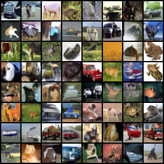

### VAE
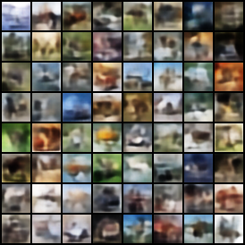

## Qualitative Analysis

**Realism.** DDPM samples have sharp edges and textures, with many recognisable
vehicles and animals. VAE samples are blurry with soft edges and
little high-frequency detail. This because the decoder predicts the mean over all plausible images for a given
latent, and averaging removes detail. The DDPM avoids this by splitting
generation into 1000 small denoising steps, none of which requires averaging.

**Diversity.** The DDPM shows wider variation in pose, colour and composition.
The VAE varies in colour and layout but its samples are similar in structure.
The Inception Score gap (7.29 vs 3.35) reflects this, since IS rewards both
confident classification and variety across samples.

**Thematic consistency.** DDPM samples are mostly identifiable as (horses/veichles) coming from CIFAR-10
categories. VAE samples seen as colour arrangements without a clear
class.

## DDPM Training Progression

Samples generated from the same fixed noise at different epochs, so the only
thing changing is the model.

| Epoch 60 | Epoch 80 |
|---|---|
| 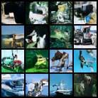 | 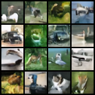 |

| Epoch 380 | Epoch 400 |
|---|---|
| 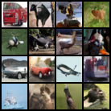 | 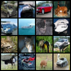 |

Early samples are dominated by noise, partly because the EMA weights are still
heavily weighted toward initialisation (0.9999^7040 ≈ 0.49 at epoch 20). By
epoch 380–400 the samples contain coherent objects.

## Training Curves

### DDPM
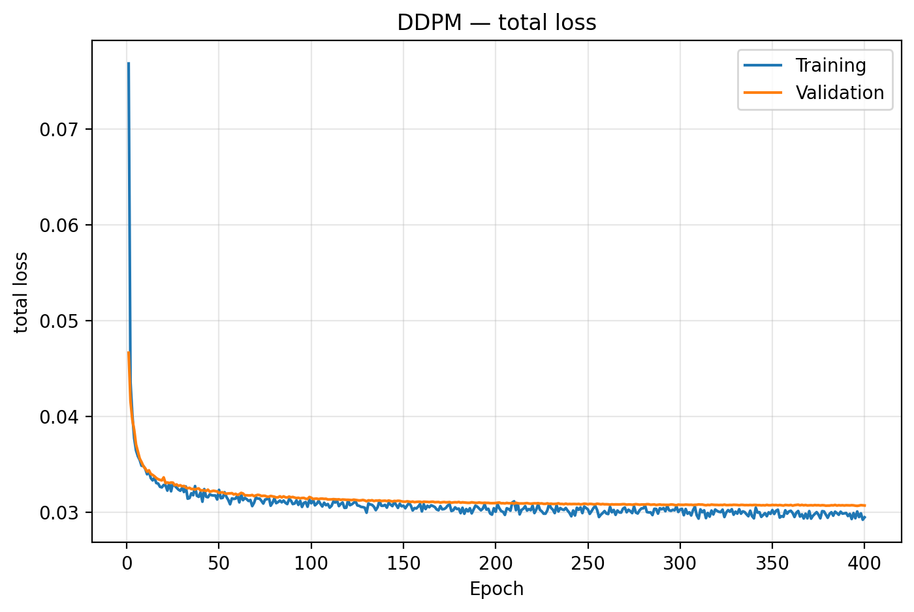

Loss dropped sharply in the first 20 epochs, then fell smoothly until epoch 400 — while sample quality changed signifcantly, as the plot
above shows. The loss averages over 1000 timesteps, most of which saturate
early, so it's not representative for the generative quality. This is why FID is used
instead. 
also the curve was still descending at epoch 400, so the model still have areas for convergence but the compute budget is limited in our case.

### VAE — total loss (negative ELBO)
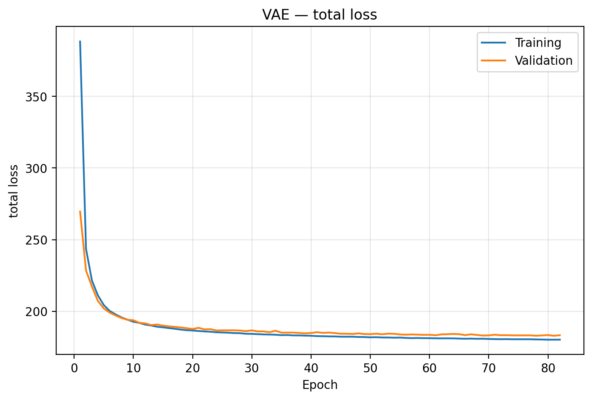

### VAE — reconstruction term
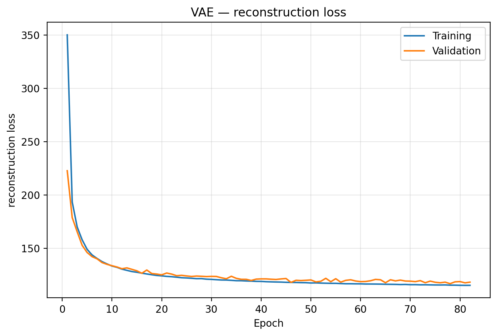

### VAE — KL term
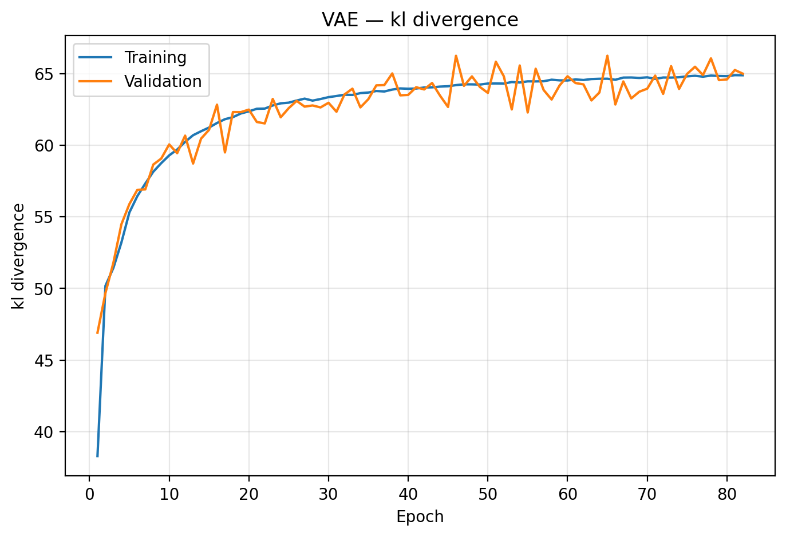

Reconstruction fell 350 → 115 while KL rose 38 → 65, and the total ELBO fell
388 → 180. KL rising while the total falls is a good sign that the encoder
stores more information because the improving decoder can now use it. Train and
validation are close, so there is no overfitting.

Unlike the DDPM, the VAE's loss reflects the model quality directly as the ELBO is the actual objective

## VAE Latent Space

### Reconstructions
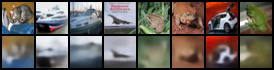

Top row: originals. Bottom row: reconstructions. Blurry but clearly the same
images — colours and composition are preserved.

Reconstructions are noticeably better than random samples, because
reconstruction uses a latent from a real image while generation draws
z ~ N(0, I). The gap indicates the aggregate posterior has drifted from the
prior, and explains why the VAE's FID is worse than its reconstruction quality
suggests.

### Interpolation
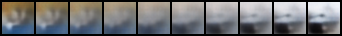

Transitions are smooth and continuous with no discontinuities, confirming a
well-regularised latent space. Midpoints are softer than endpoints, consistent
with lower density away from encoded data points.

### KL per latent dimension
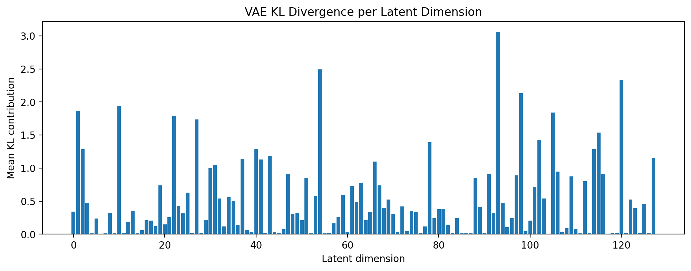

Many dimensions collapsed to the prior (KL ≈ 0) while the rest carry
information. This is *partial* posterior collapse — the model automatically
selecting an effective latent dimensionality below 128. It differs from
complete collapse, where all dimensions go to zero and the decoder ignores the
latent entirely.

The DDPM has no equivalent figure: it has no encoder, and its latent x_T has
the same dimensionality as the image and carries no compressed representation.

## Main Differences

| | VAE | DDPM |
|---|---|---|
| Objective | Maximise ELBO (explicit likelihood bound) | Predict noise at a random timestep |
| Generation | One decoder pass | 1000 sequential passes |
| Latent | Learned, 128-d, interpolable | x_T, image-sized, not learned |
| Encoder | Yes — real images can be encoded | No |
| Sample quality | Lower (blur) | Higher (sharp) |
| Speed | ~12,400× faster | Slow |
| Loss as quality proxy | Direct | Poor |
| Failure mode | Mode averaging → blur | Slow sampling; needs long training |

The VAE compresses and reconstructs in one shot under a Gaussian likelihood,
which averages over plausible outputs and produces blur. The DDPM decomposes
generation into 1000 small, well-conditioned denoising predictions, so no
averaging step blurs the result — but it pays that cost at every sample.

## Conclusion

The DDPM is clearly better on sample quality — 5.8× better FID and 2.2× better
Inception Score — but costs more budget and time to generate from. The VAE pays
its cost once during training and produces a compact latent representation that the DDPM does not provide.

